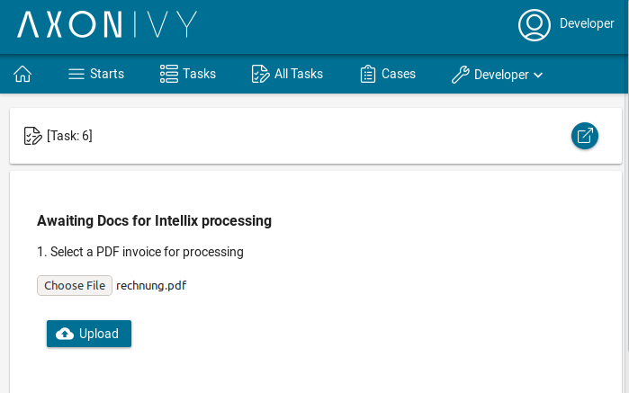
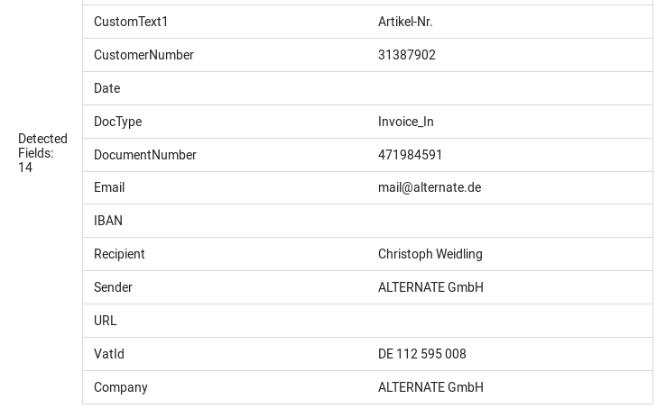

# Intelligent Indexing

Der Intelligent Indexing Konnektor integriert erweiterte Funktionen zur Dokumentenindexierung in die Workflow-Orchestrierung. Speziell für Umgebungen entwickelt, in denen Axon Ivy mit DocuWare kombiniert wird, um dokumentenbasierte Geschäftsprozesse zu verwalten, ermöglicht dieser Konnektor eine effiziente und einfache Extraktion von Schlüsselwörtern. Dieser Konnektor:

- basiert auf der [Intelligent Indexing](https://start.docuware.com/docuware-intelligent-indexing)-Komponente von DocuWare.
- erkennt den Inhalt von Dokumenten wie Rechnungen ohne vorheriges Training.
- enthält ein anpassbares Starter-Kit für die schnelle Integration in Ihre Axon Ivy-Prozesse.
- ist ausschließlich für Szenarien verfügbar, in denen DocuWare mit Axon Ivy integriert wird, um dokumentenbasierte Workflows zu orchestrieren, und wird nicht als Standalone-Dienst angeboten.

## Demo

1. Lade ein beliebiges Dokument als PDF hoch   
       
3. Zeige die erkannten Felder an   
    

## Einrichtung

1. Bestelle eine Intellix-Instanz über <a href="mailto:info@axonivy.com">info@axonivy.com</a>
2. Kopiere den Block `intellix-connector` aus der Datei `axonivy-intellix-connector/config/variables.yaml` in ein Projekt innerhalb deiner Arbeitsbereiche.
3. Setze deinen benutzerdefinierten Variablenwert für `host`, `username`, `password` und `msName` in der kopierten `variables.yaml`.
